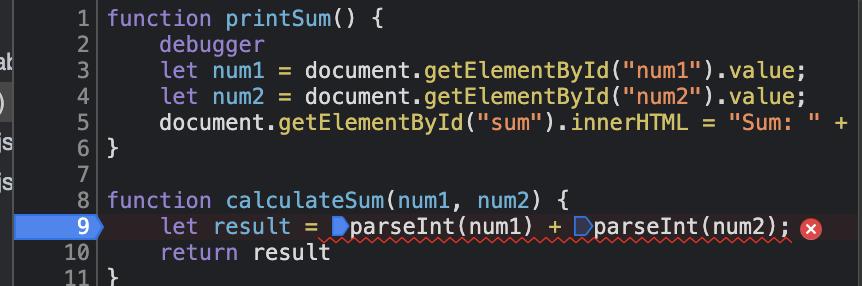

#Part 3
1. The bug is adding the two inputs while still as strings, and thus concatenating instead of adding.
2. I would fix it by making sure the variables are treated as ints when being added.
Screenshot:

3. citylots.json  
4. part2.js
5. 11.7 MB
6. 3.66 seconds
7. Mozilla/5.0, AppleWebKit, Chrome, Safari
8. Apache
9. Tuesday, 26 January 2021 22:14:13 GMT
10. application/json
11. fetchData